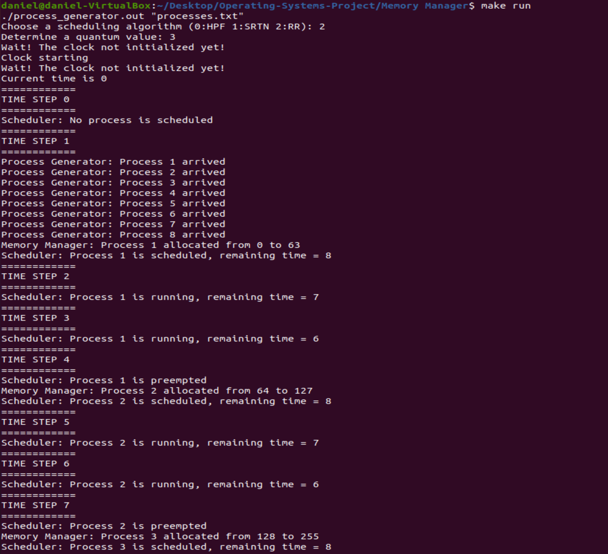
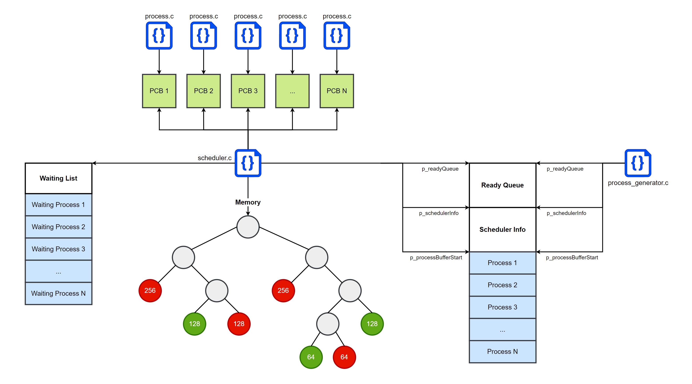

# Operating Systems Project

A simulation of an operating system with a scheduler, a memory manager, and a synchronizer.

* The scheduler can perform 3 scheduling algorithms:
	- Highest Priority First (HPF)
	- Shortest Remaining Time Next (SRTN)
	- Round Robin (RR)
* The memory manager uses the Buddy System (memory allocation technique) to allocate processes in memory (1024 bytes).
* The synchronizer solves the famous producer-consumer problem.

## Setup

The following bash commands are used to set up and run the project.

To compile the project:

```sh
make all
```

To generate a test case:

```sh
./test_generator.out
```

To run the project on the generated test case:

```sh
make run
```

The following image shows the status of the program while running.



## Data Structures

There are 4 essential data structures that manage processes in the system:

### 1. Ready Queue 

A shared linked list between the process generator and the scheduler. The process generator enqueues processes in their corresponding arrival time and the scheduler operates on the ready queue in each time step.

### 2. Process Control Block

A shared memory between the scheduler and the process. It stores the id, state (running or waiting), running time, remaining time, and waiting time of the process.

### 3. Memory

When a process is scheduled, a memory unit is allocated to it. The memory is implemented as a binary tree where leaves represent memory units.

### 4. Waiting List

If there is not enough memory space to allocate a process, the process is added to the waiting list until another process finishes and frees enough memory space to allocate the waiting process. The waiting list is implemented as a linked list and is managed by the scheduler.

## Illustrations

The following diagram explains the relation between different files and data structures.



## Utility Functions

The following table lists the utility functions that manage data structures and processes.

Function | Description
-------- | -----------
enqueue() | Inserts a new process in the ready queue.
dequeue() | Removes a process from the ready queue.
addToWaitingList() | Adds a process to the waiting list.
removeFromWaitingList()  | Removes a process from the waiting list.
allocate() | Allocates a process in a memory unit.
splitAllocate() | Splits a memory unit and allocates a process.
tryAllocate() | Allocates a process if possible and returns false otherwise.
deallocate() | Deallocates a process from the memory.
scheduleFromWaitingList() | Searches in the waiting list to schedule a process.
scheduleFromReadyQueue() | Searches in the ready queue to schedule a process.
