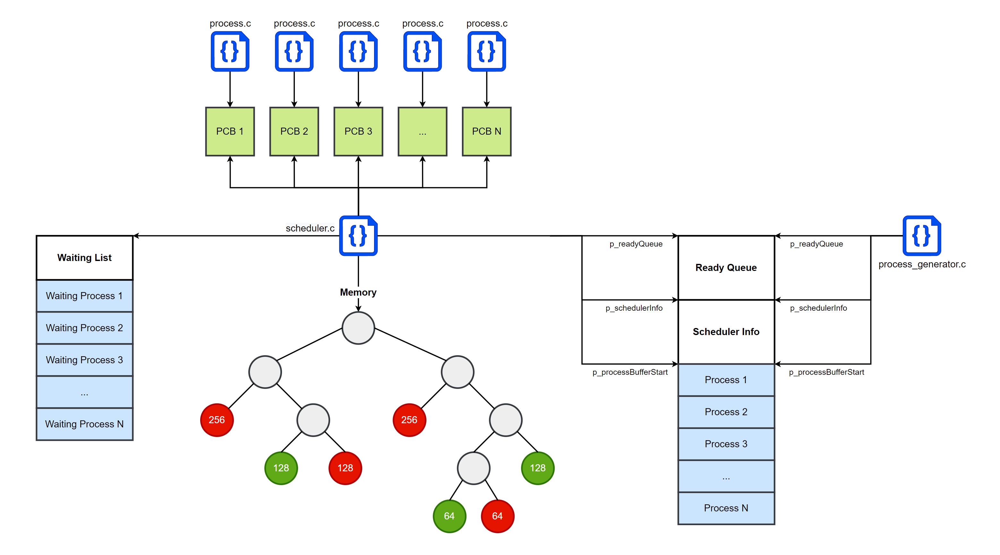

# Operating System Project

A simulation of an operating system with scheduler, a memory manager, and a synchronizer.

* The scheduler can perform 3 scheduling algorithms:
	- Highest Priority First (HPF)
	- Shortest Remaining Time Next (SRTN)
	- Round Robin (RR)
* The memory manager using the Buddy alocation system to allocated processes in a 1024 Bytes memory.
* The synchronizer solves the famous producer-consumer problem.

---

## Set Up

The following bash commands are used to set up and run the project.

To compile the project:

> make all

To generate a test case:

> ./test_generator.out

To run the project on the generated test case:

> make run

---

## Data Structures

There are 4 essential data structures used to manage processes in the system:

1. Ready Queue 

A shared linked list between the process generator and the scheduler. The process generator enqueues process in their corresponding arrival time and the scheduler operates on the ready queues in each time step.

2. Process Control Block

A shared memory between the scheduler and the process. It stores the id, state (running or waiting), running time remaining time and waiting time of the process.

3. Memory

When a process is scheduled, a memory unit is allocated for it. The memory is implemented as a binary tree where the leaves represent the memory units.

4. Waiting List

If there is not enough memory space to allocate a process, the process is added to the waiting list unitl another process finishes and frees enough memory space to allocated the waiting process. The waiting list is implemented as a linked list and is managed by the scheduler.

## Illustrations

The following diagram explains the relation between different files and data structures:

